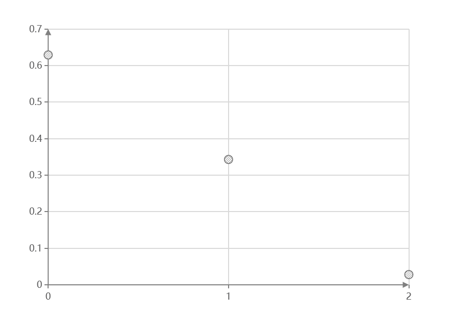

# Week4

##　201300069 邓嘉宏

### 3.1

$\because P(X=k)=\left(\begin{matrix}n\\k\end{matrix}\right)p^k(1-p)^{n-k}$

$\therefore \displaystyle E(X)=\sum_{k=0}^nk\left(\begin{matrix}n\\k\end{matrix}\right)p^k(1-p)^{n-k}=(1-p)^n\sum_{k=1}^n\left(\begin{matrix}n\\k\end{matrix}\right)k(\frac{p}{1-p})^k$

$\displaystyle  \because (1+x)^n=\sum_{k=0}^n\left(\begin{matrix}n\\k\end{matrix}\right)x^k$

两边求导得:

$n(1+x)^{n-1}=\displaystyle \sum_{k=1}^n\left(\begin{matrix}n\\k\end{matrix}\right)kx^{k-1}$

即: $nx(1+x)^{n-1}=\displaystyle \sum_{k=1}^n\left(\begin{matrix}n\\k\end{matrix}\right)kx^{k}$

$将 x=\displaystyle \frac{p}{1-p} 代入得:$

$\displaystyle n\frac{p}{1-p}(\frac{1}{1-p})^{n-1}=\displaystyle \sum_{k=1}^n\left(\begin{matrix}n\\k\end{matrix}\right)k(\frac{p}{1-p})^{k}$

**期望:** $\displaystyle E(X)=(1-p)^n\sum_{k=1}^n\left(\begin{matrix}n\\k\end{matrix}\right)k(\frac{p}{1-p})^k=(1-p)^n\frac{np}{1-p}(\frac{1}{1-p})^{n-1}=np$

$\because \displaystyle E(X^2)=\sum_{k=0}^nk^2\left(\begin{matrix}n\\k\end{matrix}\right)p^k(1-p)^{n-k}=(1-p)^n\sum_{k=0}^nk(k-1)\left(\begin{matrix}n\\k\end{matrix}\right)(\frac{p}{1-p})^k+np$

$\displaystyle  \because (1+x)^n=\sum_{k=0}^n\left(\begin{matrix}n\\k\end{matrix}\right)x^k$

两边求二次导得:

$n(n-1)(1+x)^{n-2}=\displaystyle \sum_{k=1}^n\left(\begin{matrix}n\\k\end{matrix}\right)k(k-1)x^{k-2}$

即: $n(n-1)x^2(1+x)^{n-2}=\displaystyle \sum_{k=1}^n\left(\begin{matrix}n\\k\end{matrix}\right)k(k-1)x^{k}$

$将 x=\displaystyle \frac{p}{1-p} 代入得:$

$\displaystyle n(n-1)(\frac{p}{1-p})^2(\frac{1}{1-p})^{n-2}=\displaystyle \sum_{k=1}^n\left(\begin{matrix}n\\k\end{matrix}\right)k(k-1)(\frac{p}{1-p})^{k}$

$\displaystyle E(X^2)=(1-p)^n\sum_{k=1}^nk(k-1)\left(\begin{matrix}n\\k\end{matrix}\right)(\frac{p}{1-p})^k+np=(1-p)^nn(n-1)(\frac{p}{1-p})^2(\frac{1}{1-p})^{n-2}+np=n^2p^2-np^2+np$

**方差:** $Var(X)=E(X^2)-(E(X))^2=np(1-p)$

### 3.2

$\because P(X=k)=(1-p)^{k-1}p$

$\therefore \displaystyle E(X)=\sum_{k=1}^\infty kp(1-p)^{k-1}=p\sum_{k=1}^\infty k(1-p)^{k-1}$

$\displaystyle \because \sum_{k=0}^\infin x^k=(1-x)^{-1}$

两边求导得:

$\displaystyle \because \sum_{k=0}^\infin kx^{k-1}=\frac{1}{(1-x)^2}$

令 x=1-p, 可得 **期望:** $E(X)=1/p$

对上面的级数展开式求二阶导有:

$\displaystyle \sum_{k=0}^\infin k(k-1)x^{k-2}=\frac{2}{(1-x)^3}$

$\because \displaystyle E(X^2)=\sum_{k=0}^\infin k^2p(1-p)^{k-1}=p\sum_{k=0}^\infin k(k-1)(1-p)^{k-1}+1/p=(2-p)/p^2$

**方差:** $Var(X)=E(X^2)-(E(X))^2=(1-p)/p^2$

### 3.3

$P(X=k)=\left(\begin{matrix}k-1\\r-1\end{matrix}\right)p^r(1-p)^{k-r}$ 

$\because \displaystyle \sum_{k=r}^\infin \left(\begin{matrix}k+1-1\\r+1-1\end{matrix}\right)p^{r+1}(1-p)^{k-r}=1$

$$
\begin{split}
\displaystyle E(X)&=\sum_{k=r}^\infin k\left(\begin{matrix}k-1\\r-1\end{matrix}\right)p^r(1-p)^{k-r}\\&=\frac{r}{p}\sum_{k=r}^\infin \left(\begin{matrix}k\\r\end{matrix}\right)p^{r+1}(1-p)^{k-r}\\&=\frac{r}{p}\sum_{k=r}^\infin \left(\begin{matrix}k+1-1\\r+1-1\end{matrix}\right)p^{r+1}(1-p)^{k-r}\\&=\frac{r}{p}
\end{split}
$$

$$
\begin{split}
\displaystyle E(X^2)&=\sum_{k=r}^\infin k^2\left(\begin{matrix}k-1\\r-1\end{matrix}\right)p^r(1-p)^{k-r}\\&=\frac{r}{p}\sum_{k=r}^\infin (k+1-1)\left(\begin{matrix}k\\r\end{matrix}\right)p^{r+1}(1-p)^{k-r}\\&=\frac{r(r+1)}{p^2}\sum_{k=r}^\infin \left(\begin{matrix}k+1\\r+1\end{matrix}\right)p^{r+1}(1-p)^{k-r}-\frac{r}{p}\\&=\frac{r(r+1)}{p^2}-\frac{r}{p}
\end{split}
$$

$\therefore \displaystyle Var(X)=E(X^2)-(E(X))^2=\frac{r(1-p)}{p^2}$

### 3.4

$\displaystyle P(X=k)=\frac{\lambda^k}{k!}e^{-\lambda}$

$\displaystyle \because e^\lambda=\sum_{k=0}^\infin \frac{\lambda^k}{k!}$

$\displaystyle \therefore E(X)=\sum_{k=0}^\infin k\frac{\lambda^k}{k!}e^{-\lambda}=\lambda e^{-\lambda}\sum_{k=1}^\infin \frac{\lambda^{k-1}}{(k-1)!}=\lambda$

$\displaystyle \because E(X^2)=\sum_{k=0}^\infin k^2\frac{\lambda^k}{k!}e^{-\lambda}=\lambda e^{-\lambda}\sum_{k=1}^\infin k \frac{\lambda^{k-1}}{(k-1)!}=\lambda^2e^{-\lambda}\sum_{k=2}^\infin \frac{\lambda^{k-2}}{(k-2)!}+\lambda=\lambda^2+\lambda$

$\therefore Var(X)=E(X^2)-(E(X))^2=\lambda$

### 3.5

$令 x 表示一叶节点的高度, x_i 表示第i次选择时该叶节点被选中$

$\displaystyle 因为第 i 次选择时一共有 i 个叶节点, 所以P(x_i)=\frac{1}{i}$

$\displaystyle \therefore E(X)=E(\sum_{i=1}^kx_i)=\sum_{i=1}^kE(x_i)=\sum_{i=1}^k\frac{1}{i}=o(\ln k)$

### 3.6

**有放回:**

$\displaystyle P(X=1)=\frac{1}{10^5}$

$\displaystyle P(X=2)=\frac{1+\left(\begin{matrix}5\\4\end{matrix}\right)+\left(\begin{matrix}5\\3\end{matrix}\right)+\left(\begin{matrix}5\\2\end{matrix}\right)+\left(\begin{matrix}5\\1\end{matrix}\right)}{10^5}=\frac{31}{10^5}$

$\displaystyle P(X=3)=\frac{1+\left(\begin{matrix}5\\4\end{matrix}\right)\times 2+\left(\begin{matrix}5\\3\end{matrix}\right)\times 2^2+\left(\begin{matrix}5\\2\end{matrix}\right)\times 2^3+\left(\begin{matrix}5\\1\end{matrix}\right)\times 2^4}{10^5}=\frac{211}{10^5}$

$\displaystyle P(X=4)=\frac{1+\left(\begin{matrix}5\\4\end{matrix}\right)\times 3+\left(\begin{matrix}5\\3\end{matrix}\right)\times 3^2+\left(\begin{matrix}5\\2\end{matrix}\right)\times 3^3+\left(\begin{matrix}5\\1\end{matrix}\right)\times 3^4}{10^5}=\frac{781}{10^5}$

$\displaystyle P(X=i)=\frac{1+\left(\begin{matrix}5\\4\end{matrix}\right)\times (i-1)+\left(\begin{matrix}5\\3\end{matrix}\right)\times (i-1)^2+\left(\begin{matrix}5\\2\end{matrix}\right)\times (i-1)^3+\left(\begin{matrix}5\\1\end{matrix}\right)\times (i-1)^4}{10^5}, i=5, 6, 7, 8, 9, 10.$

|X| 1 | 2 | 3 | 4 | 5 | 6 | 7 | 8 | 9 | 10 |
|---|---|---|---|---|---|---|---|---|---|---|
|P|$\displaystyle \frac{1}{10^5}$  | $\displaystyle \frac{31}{10^5}$ | $\displaystyle \frac{211}{10^5}$| $\displaystyle \frac{781}{10^5}$ | $\displaystyle \frac{2101}{10^5}$ | $\displaystyle \frac{4651}{10^5}$ |  $\displaystyle \frac{9031}{10^5}$|$\displaystyle \frac{15961}{10^5}$  | $\displaystyle \frac{26281}{10^5}$ |$\displaystyle \frac{40951}{10^5}$|

**无放回:**

$\displaystyle P(X=5)=\frac{(5)_5}{(10)_5}$

$\displaystyle P(X=6)=\frac{5\times (5)_4}{(10)_5}$

$\displaystyle P(X=7)=\frac{5\times (6)_4}{(10)_5}$

$\displaystyle P(X=8)=\frac{5\times (7)_4}{(10)_5}$

$\displaystyle P(X=9)=\frac{5\times (8)_4}{(10)_5}$

$\displaystyle P(X=10)=\frac{5\times (9)_4}{(10)_5}$

|X|5|6|7|8|9|10|
|---|---|---|---|---|---|-
|P|$\displaystyle \frac{120}{30240}$|$\displaystyle \frac{600}{30240}$|$\displaystyle \frac{1800}{30240}$|$\displaystyle \frac{4200}{30240}$|$\displaystyle \frac{8400}{30240}$|$\displaystyle \frac{15120}{30240}$

### 3.7

令 Y 表示废品数:

$$
\begin{split}
P(0\leq Y\leq x)&=\displaystyle \sum_{k=0}^xP(Y=k)\\&=\sum_{k=0}^x\left(\begin{matrix}100+x\\k\end{matrix}\right)0.01^k0.99^{100+x-k}\\&\approx\sum_{k=0}^x\frac{(1+0.01x)^k}{k!}e^{-1-0.01x}>0.95
\end{split}
$$

$解得 x\geq3, x的最小值为3.$

### P55 2

#### (1)

|x|3|4|5|
|-|-|-|-|
|P|$\displaystyle \frac{1}{10}$|$\displaystyle \frac{3}{10}$|$\displaystyle \frac{6}{10}$

#### (2)

|x|1|2|3|4|5|6|
|-|-|-|-|-|-|-|
|P|$\displaystyle \frac{11}{36}$|$\displaystyle \frac{9}{36}$|$\displaystyle \frac{7}{36}$|$\displaystyle \frac{5}{36}$|$\displaystyle \frac{3}{36}$|$\displaystyle \frac{1}{36}$

### P55 3

#### (1)

|x|0|1|2|
|-|-|-|-|
|P|$\displaystyle \frac{286}{455}$|$\displaystyle \frac{156}{455}$|$\displaystyle \frac{13}{455}$

#### (2)

### P113 2

在一次检测中次品数多于1的概率: $1-(0.9^{10}+10\times 0.1\times 0.9^9)\approx 0.264$

X的分布列:

|X|0|1|2|3|4|
|-|-|-|-|-|-|
|P|0.293|0.421|0.227|0.054|0.005|

$E(X)=0\times 0.293+1\times 0.421+2\times 0.227+3\times 0.054+4\times 0.005=1.057$

### P113 3

X的分布列:

|X|1|2|3|4|
|-|-|-|-|-|
P|$\displaystyle \frac{37}{64}$|$\displaystyle \frac{19}{64}$|$\displaystyle \frac{7}{64}$|$\displaystyle \frac{1}{64}$

$\displaystyle E(X)=1\times \frac{37}{64}+2\times \frac{19}{64}+3\times\frac{7}{64}+4\times\frac{1}{64}=\frac{25}{16}$

### P114 4

#### (1)

$\displaystyle \sum_{j=1}^\infin (-1)^{j+1}\frac{3^j}{j}\times \frac{2}{3^j}=\sum_{j=1}^\infin (-1)^{j+1}\frac{2}{j}, 因为该级数不绝对收敛,所以X的期望不存在.$

#### (2)

$\displaystyle P(X=j)=\frac{1}{j(j+1)}$

$\displaystyle \sum_{j=1}^\infin j\times \frac{1}{j(j+1)}=\sum_{j=1}^\infin \frac{1}{j+1}, 因为该级数不绝对收敛, 所以X的数学期望不存在.$

### P114 6

#### (1)
$E(X)=-2\times 0.4+0\times 0.3+2\times 0.3=-0.2$

$E(X^2)=(-2)^2\times 0.4+0\times 0.3+2^2\times 0.3=2.8$

$E(3X^2+5)=3E(X^2)+5=13.4$

#### (2)

$\displaystyle E(1/(X+1))=\sum_{k=0}^\infin \frac{1}{k+1}\frac{\lambda^k}{k!}e^{-\lambda}=\frac{e^{-\lambda}}{\lambda}\sum_{k=0}^\infin \frac{\lambda^{k+1}}{(k+1)!}=\frac{1-e^{-\lambda}}{\lambda}$

