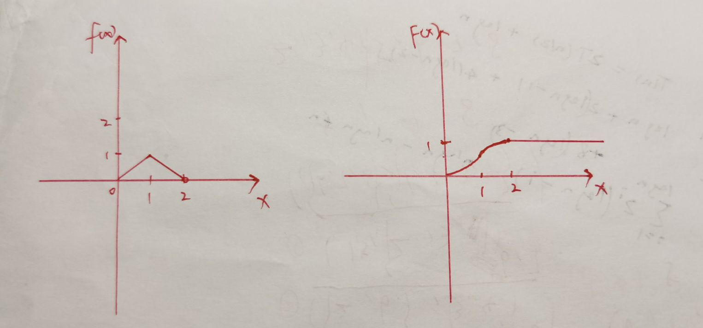

# Week5  

##　201300069 邓嘉宏

### P57 18

$$
\displaystyle
F(X)=
\begin{cases}
0,x\leq0\\
\displaystyle \frac{x}{a} ,0<x<a\\
1,x\geq a
\end{cases}    
$$

### P57 19

#### (1)

$P(X\leq 3)=F(3)=1-e^{-1.2}$

#### (2)

$P(X>4)=1-F(4)=e^{-1.6}$

#### (3)

$P(3\leq X\leq 4)=F(4)-F(3)=e^{-1.2}-e^{-1.6}$

#### (4)

$P(X\leq 3||X\geq 4)=P(X\leq 3)+P(X>4)=1-e^{-1.2}+e^{-1.6}$

#### (5)

$P(X=2.5)=0$

### P57 20

#### (1)

$P(X<2)=F(2)=\ln 2$

$P(0<X\leq 3)=F(3)-F(0)=1$

$P(2<X<5/2)=F(5/2)-F(2)=\ln{\displaystyle \frac{5}{4}}$

#### (2)

$F'(X)=f(x)$

$$
\displaystyle \therefore 
f(x)=
\begin{cases}
0, x<1\\
\displaystyle \frac{1}{x}, 1\leq x<e\\
0, x\geq e
\end{cases}
$$

### P57 21

#### (1)

$当x<1时, F(x)=0$

$当1\leq x\leq 2时, F(x)=\displaystyle \int _1^x(2-\frac{2}{t^2})dt=2x+\frac{2}{x}-4$

$当x>2时,F(x)=1$

$$
\displaystyle \therefore 
F(x)=
\begin{cases}
0, x<1\\
\displaystyle 2x+\frac{2}{x}-4, 1\leq x\leq 2\\
0, x>2
\end{cases}
$$

#### (2)

$当x<0,F(x)=0$

$当0\leq x<1,F(x)=\displaystyle \int_0^xtdt=\frac{1}{2}x^2$

$当1\leq x<2,F(x)=\displaystyle \frac{1}{2}+\int_1^x(2-t)dt=2x-\frac{1}{2}x^2-1$

$当x\geq 2,F(X)=1$

$$
\displaystyle \therefore 
F(x)=
\begin{cases}
0, x<0\\
\displaystyle \frac{1}{2}x^2, 0\leq x<1\\
\displaystyle 2x-\frac{1}{2}x^2-1, 1\leq x<2\\
1, x\geq 2
\end{cases}
$$

### P57 23

$对单个器件,P(X>1500)=\displaystyle \int_{1500}^{+\infin}\displaystyle\frac{1000}{x^2}=\frac{2}{3}$

$令事件A表示5只器件中至少有2只寿命大于1500小时$

$\displaystyle P(A)=1-(\frac{1}{3})^5-5\times \frac{2}{3}\times (\frac{1}{3})^4=\frac{232}{243}$

### P57 24

$一次中,不离开窗口的概率:F(10)=1-e^{-2}$

$分布律:P(Y=k)=\left(\begin{matrix}5\\k \end{matrix}\right)e^{-2k}(1-e^{-2})^{5-k}$

$P(Y\geq 1)=1-(1-e^{-2})^5$

### P57 25

$该方程有实根要求:K\leq -1或K\geq 2$

$P({有实根})=F(5)-F(2)=\displaystyle \frac{3}{5}$

### P115 18

$E(X)=\displaystyle \int_0^{+\infin}\frac{x^2}{\sigma^2}e^{\frac{-x^2}{2\sigma^2}}dx=\int_0^{+\infin}e^{\frac{-x^2}{2\sigma^2}}dx=\pi$

$\because E(X^2)=\displaystyle \int_0^{+\infin}\frac{x^3}{\sigma^2}e^{\frac{-x^2}{2\sigma^2}}dx=\int_0^{+\infin}e^{\frac{-x^2}{2\sigma^2}}dx^2=2\sigma^2$

$\therefore D(X)=E(X^2)-(E(X))^2=2\sigma^2-\pi^2$

### 4.2

$设X表示长方形的宽$

$E(X)=\displaystyle \int_0^2\frac{1}{2}xdx=1$

$周长的期望: E(20/X+2X)=\displaystyle \int_0^2x+\frac{10}{x}dx, 不存在.$

所以, 期望和方差不存在.

### 4.3

$\because \displaystyle \int_0^{\infin}Ae^{-x}dx=A=1$

$\therefore A=1$

$E(Y)=\displaystyle \int_0^{+\infin}e^{-3x}dx=\frac{1}{3}$

### 4.4

$\because \displaystyle \int_{-\infin}^{+\infin}e^{\frac{-t^2}{2}}dt=\sqrt {2\pi}$

$\displaystyle 令 t=\frac{t-u}{\sigma}$

$则: \displaystyle \int_{-\infin}^{+\infin}e^{\frac{-(t-u)^2}{2\sigma^2}}d\frac{t-u}{\sigma}=\sqrt{2\pi}=\frac{1}{\sigma}\int_{-\infin}^{+\infin}e^{\frac{-(t-u)^2}{2\sigma^2}}dt$

$\therefore \displaystyle \int_{-\infin}^{+\infin}e^{\frac{-(t-u)^2}{2\sigma^2}}dt=\sqrt{2\pi}\sigma$