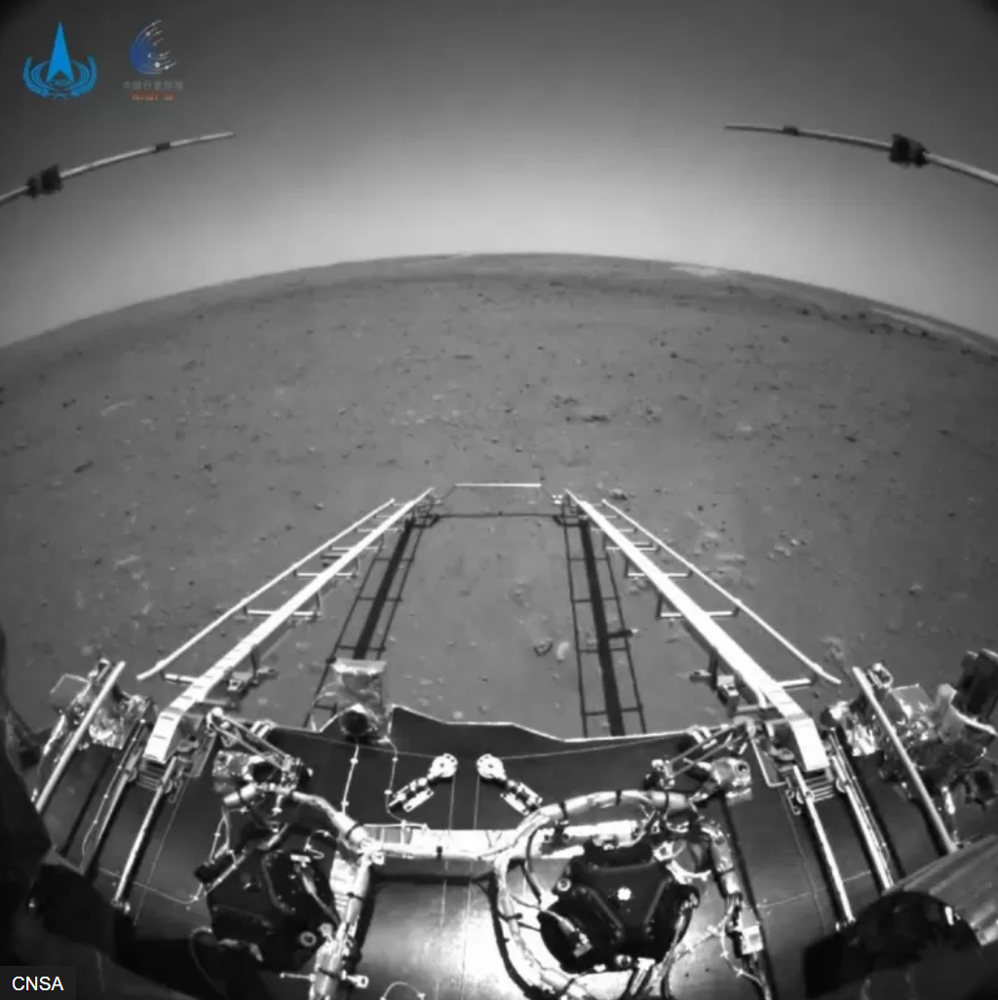

# 我们的征途——中国航天事业

## 1. 发展概述

### 新闻背景

- 4月12日下午，习近平总书记到海南文昌航天发射场视察，习近平强调：”强化使命担当，勇于创新突破，努力建设世界一流航天发射场。”

- 4月16日，”太空出差三人组”凯旋，成功完成中国航天史上时间最长的一次太空飞行。

- 5月5日，我国在太原卫星发射中心使用长征二号丁运载火箭，成功将吉林一号宽幅01C卫星及搭载的吉林一号高分03D等8颗卫星发射升空。主星顺利进入预定轨道，发射任务获得圆满成功。

- 5月10日，我国在海南文昌航天发射场运用长征七号遥五运载火箭，成功将天舟四号货运飞船发射升空，并采用快速交会对接技术，在约6.5小时后顺利与空间站核心舱进行后向对接。这标志着2022年中国空间站建造任务的首次发射任务圆满成功。

### 1.1 启航——中国问天路的开辟

1957年10月4日，苏联成功发射了人类第一颗人造地球卫星。几个月后，美国也将自己的人造地球卫星送上了太空。而人造地球卫星是环绕在地球轨道上运行的无人航天器，它在科学探测与研究、气象监测等领域有广泛的用途。这对中国来说是巨大的挑战。1958年5月17日，中国共产党第八届全国代表大会第二次会议正在北京中南海怀仁堂进行。这天下午，**毛主席说：“苏联卫星上天，我们想不想搞个把两个卫星，我们也要搞一点卫星。”要想把卫星发射到太空，就必须依靠运载火箭。然而，当时的中国连几公里飞行高度的火箭都没有。**

很快，在周恩来总理的安排下，中国科学院成立了中国第一个卫星小组——“581”小组，担任组长的是世界级火箭专家钱学森。1960年初，中国自行研制的第一枚探空火箭实现了8公里距离的飞行。毛泽东曾专门视察这枚探空火箭。

1965年8月，中央专委决定重启人造地球卫星项目，代号“651”工程。1970年初，长征一号运载火箭的各项研制工作和飞行试验全部完成，东方红一号卫星也完成了总装。1970年4月24日，长征一号运载火箭将东方红一号卫星送入太空，传回的《东方红》旋律让国人振奋。

**长征一号的成功发射，开启了中国人探索太空的道路。由此诞生的长征系列运载火箭，拉开了中国航天史上一个划时代的篇章。**

### 1.2 奋起——返回式卫星成功发射

当国人还沉浸在我国第一颗人造地球卫星发射成功之时，美国有人预言：美苏将在10年内诞生返回式卫星！**很快，研制返回式卫星及其运载工具，随之也被我国提上了日程。**

**经过三年的研究改造，以东风五号导弹为基础的长征二号运载火箭研制成功。**

**然而，1974年11月5日，搭载着中国第一颗返回式卫星的长征二号运载火箭却发射失利，科研团队背负着巨大的压力。**

但是，失败并不能将中国航天人打倒！在钱学森的指挥下，科研人员重新对卫星和火箭的几十万个零件进行全面测试，并采取有效的安全保障措施，着手进行运载火箭的改进。同时，对原先总装完成的产品全部分解，返回各生产厂家重新进行严格的质量复查。

1975年11月26日11时30分，载着第一颗返回式卫星的长征二号运载火箭发射成功，卫星在轨道上按计划运行了3天，在约定的时间内回到祖国。

**中国第一颗返回式卫星的成功发射，开创了中国航天遥感事业的先河。中国也成为世界上第三个掌握卫星回收技术的国家。**以此为基础，中国远征太空的航程也得以再次起航！

### 1.3 飞天——千年梦想变为现实

1992年9月21日，一场绝密会议在中南海勤政殿里召开，党中央正式批准“中国载人航天工程”立项。巧合的是，到了1992年，钱学森主导的各项航天重大工程中，只有载人航天尚未成功。

老一辈科学家年事已高，新一代航天人必须接过前辈的重担，实现中国人的飞天梦。

1999年11月20日，经过5年的研制、两年的总装，长征二号F运载火箭终于在规定时间内迈上执行任务的征程。2003年10月14日，长征二号F火箭顺利将神舟五号飞船送入预定的轨道，**杨利伟**成为进入太空的第一位中国人！

**中国正式成为全球第三个独立将航天员送上太空的国家！**

### 1.4 深空足迹——从探月到火星探测

人造卫星、载人航天、深空探测是国际上公认的航天三大领域。开展月球探测工作是我国迈出航天深空探测第一步的重大举措。

2020年11月24日，“嫦娥五号”发射成功。通过机械臂在月球表面采样和钻具钻取采样两种方式，她采集到月球表面样品，并成功带回到祖国。

**自此，探月工程圆满完成了“绕、落、回”三步走战略，为未来我国开展月球和行星探测奠定了坚实基础。**

紧接着探月工程的脚步，**2020年7月23日12时41分，中国首次火星探测任务天问一号探测器，在文昌航天发射场，由长征五号遥四运载火箭发射升空。**

### 1.5. 中国空间站——我们的征途是星辰大海

2008年9月25日，神舟七号飞船成功发射，升空43小时后，航天员翟志刚开始了中国人的第一次舱外活动，这次任务的成功，为中国空间站的建设奠定了技术基础。2010年9月25日，中共中央批准《载人空间站工程实施方案》，正式启动载人空间站工程。

2011年 ~ 2017年间，”天宫一号”、”神舟八号”、”神舟九号”、”神舟十号”、”天宫二号”、”神舟十一号”、”天舟一号”等实验室飞船、载人飞船、货运飞船的成功发射验证了我国建造空间实验室的能力，为我国空间站工程研制建设奠定更加坚实的技术基础，也为运营管理积累了重要经验。

终于，在2021年4月29日，天宫空间站的核心舱“天和”在海南文昌发射成功，正式开启了我国载人航天工程的空间站时代。而后，”神舟十二号”乘组、”神舟十三号”乘组分别于2021年6月至2021年9月、2021年10月至2022年4月来到天和核心舱，**创造了中国航天员连续在轨飞行时长新纪录。**

**星空浩瀚无比，探索永无止境**。从东方红一号到北斗组网；从载人航天到深空探测再到建造空间站，中国航天事业达到了一个又一个里程碑，将为人类和平利用太空作出更多开拓性贡献。**2022年是空间站建造决战决胜之年，努力攀登，矢志奋斗，航天员漫步太空的身影将更加自信从容，中国人将更好地探索、拥抱这深邃宇宙。**

